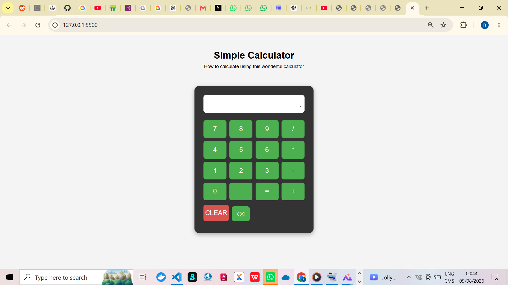

# Simple Calculator

A simple and responsive calculator built with HTML, CSS, and JavaScript.

This project was created to practice JavaScript fundamentals, DOM manipulation, event handling, keyboard interaction, and basic calculator logic.

## Features

- Addition, subtraction, multiplication, and division
- Decimal calculations
- Clear button
- Backspace button
- Keyboard support
- Enter key to calculate
- Escape key to clear the display
- Prevents multiple operators from being entered together
- Prevents invalid decimal input
- Handles division by zero
- Responsive design for different screen sizes

## Technologies Used

- HTML5
- CSS3
- JavaScript

## How to Use

1. Clone or download this repository.
2. Open the project folder in Visual Studio Code.
3. Open `index.html` in your browser.
4. Use the calculator buttons or your keyboard to perform calculations.

## Keyboard Controls

| Key | Action |
|---|---|
| `0-9` | Enter numbers |
| `+` | Addition |
| `-` | Subtraction |
| `*` | Multiplication |
| `/` | Division |
| `.` | Decimal point |
| `Enter` | Calculate |
| `Backspace` | Delete the last character |
| `Escape` | Clear the display |

## Screenshot



## Project Structure

```text
simple-calculator/
│
├── index.html
├── style.css
├── app.js
├── README.md
│
└── images/
    └── calculator.png